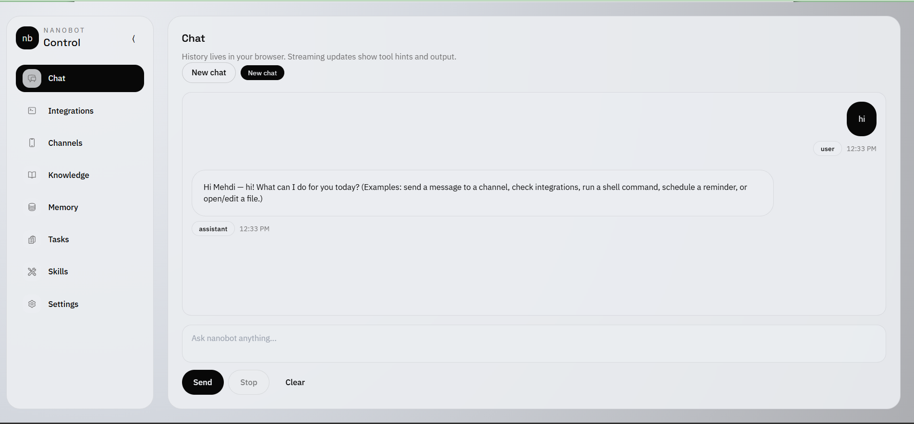
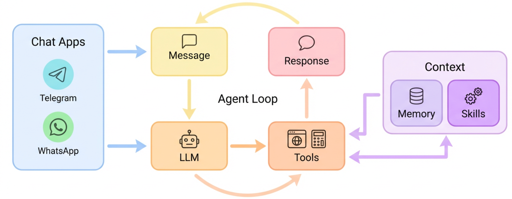

<div align="center">
  
  <h1>nanobot-web: Web UI for Nanobot</h1>
  <p>
    A solo-use, Web UI version of <a href="https://github.com/HKUDS/nanobot">HKUDS/nanobot</a> — the ultra-lightweight personal AI assistant.
  </p>
  <p>
    
    
    
  </p>
</div>

## What is this?




**nanobot-web** is a fork of [nanobot](https://github.com/HKUDS/nanobot) rebuilt for **solo / personal use** with a **React + Tailwind Web UI**. All multi-user infrastructure (PostgreSQL, Redis, JWT auth) has been removed — data is stored in simple JSON/JSONL/Markdown files on disk, just like the original nanobot.

## Architecture

<p align="center">
  
</p>

```
Chat Platforms → Channels → MessageBus → AgentLoop → LLM Providers
                                ↕
                        Tools / Memory / Skills
```

All data lives in `~/.nanobot-web/` as flat files — no external services required.

## Features

All features from [nanobot](https://github.com/HKUDS/nanobot) are included:

### Web UI (new in nanobot-web)
- Chat with streaming output
- Tool toggles and config editing from the browser
- Session history
- Knowledge and prompt management
- No login — open `http://localhost:18790` and start chatting

### 13 Chat Channels
| Channel | What you need |
|---------|---------------|
| **Telegram** | Bot token from @BotFather |
| **Discord** | Bot token + Message Content intent |
| **WhatsApp** | QR code scan (Node.js bridge) |
| **Feishu** | App ID + App Secret (WebSocket) |
| **Mochat** | Claw token |
| **DingTalk** | App Key + App Secret (Stream Mode) |
| **Slack** | Bot token + App-Level token (Socket Mode) |
| **Email** | IMAP/SMTP credentials |
| **QQ** | App ID + App Secret |
| **Matrix** | Access token + homeserver (optional E2EE) |
| **Wecom** | Bot ID + Bot Secret |

### 20+ LLM Providers
| Provider | Purpose | Get API Key |
|----------|---------|-------------|
| `openrouter` | All models via one key (recommended) | [openrouter.ai](https://openrouter.ai) |
| `anthropic` | Claude direct | [console.anthropic.com](https://console.anthropic.com) |
| `openai` | GPT direct | [platform.openai.com](https://platform.openai.com) |
| `azure_openai` | Azure OpenAI | [portal.azure.com](https://portal.azure.com) |
| `deepseek` | DeepSeek direct | [platform.deepseek.com](https://platform.deepseek.com) |
| `gemini` | Gemini direct | [aistudio.google.com](https://aistudio.google.com) |
| `groq` | LLM + Voice transcription (Whisper) | [console.groq.com](https://console.groq.com) |
| `dashscope` | Qwen (Alibaba) | [dashscope.console.aliyun.com](https://dashscope.console.aliyun.com) |
| `moonshot` | Moonshot/Kimi | [platform.moonshot.cn](https://platform.moonshot.cn) |
| `zhipu` | Zhipu GLM | [open.bigmodel.cn](https://open.bigmodel.cn) |
| `minimax` | MiniMax direct | [platform.minimaxi.com](https://platform.minimaxi.com) |
| `volcengine` | VolcEngine | [volcengine.com](https://www.volcengine.com) |
| `byteplus` | VolcEngine international | [byteplus.com](https://www.byteplus.com) |
| `siliconflow` | SiliconFlow (硅基流动) | [siliconflow.cn](https://siliconflow.cn) |
| `aihubmix` | API gateway | [aihubmix.com](https://aihubmix.com) |
| `custom` | Any OpenAI-compatible endpoint | — |
| `ollama` | Local models (Ollama) | — |
| `vllm` | Local models (vLLM) | — |
| `openai_codex` | Codex (OAuth) | `nanobot-web provider login openai-codex` |
| `github_copilot` | GitHub Copilot (OAuth) | `nanobot-web provider login github-copilot` |

### Agent Tools
- **File I/O** — read, write, edit, list files
- **Shell execution** — run commands (sandboxable to workspace)
- **Web search** — Brave Search, Serper (Google), or fetch any URL
- **Scheduled tasks** — natural language cron with timezone support
- **Subagents** — spawn background tasks
- **MCP** — connect external tool servers (stdio + HTTP/SSE)
- **Integrations** — Composio-powered (Google Calendar, Gmail, Notion, etc.)
- **Service tools** — Weather, News, Wolfram Alpha (with API keys)

### Memory & Skills
- **Two-layer memory** — `MEMORY.md` (long-term facts) + `HISTORY.md` (grep-searchable log)
- **Token-based consolidation** — automatically archives old messages when context fills up
- **Skill plugins** — built-in skills (GitHub, weather, tmux, etc.) + custom skills in workspace
- **Heartbeat** — periodic proactive tasks via `HEARTBEAT.md`

## Install

**From source (recommended)**

```bash
git clone https://github.com/otman-ai/nanobot-web.git
cd nanobot-web
pip install -e ".[web]"
```

**From PyPI**

```bash
pip install "nanobot-web[web]"
```

## Quick Start

**1. Initialize**

```bash
nanobot-web onboard
```

**2. Configure** (`~/.nanobot-web/config.json`)

```json
{
  "providers": {
    "openrouter": {
      "apiKey": "sk-or-v1-xxx"
    }
  },
  "agents": {
    "defaults": {
      "model": "anthropic/claude-sonnet-4-6"
    }
  }
}
```

**3. Start the Web UI**

```bash
nanobot-web web
```

Then open `http://localhost:18790` in your browser.

**Or use the CLI**

```bash
nanobot-web agent              # interactive mode
nanobot-web agent -m "Hello"   # single message
```

**Or start the gateway** (connects all chat channels + cron + heartbeat)

```bash
nanobot-web gateway
```

## Web UI Development

```bash
# Start the API server
nanobot-web web

# In another terminal, start the frontend dev server
cd frontend
npm install
npm run dev
```

Open `http://localhost:5173` (Vite dev server proxies to the API).

## Configuration

Config file: `~/.nanobot-web/config.json`

All configuration is identical to [nanobot](https://github.com/HKUDS/nanobot) — refer to the upstream README for detailed channel, provider, MCP, and security configuration.

### MCP (Model Context Protocol)

Config format is compatible with Claude Desktop / Cursor:

```json
{
  "tools": {
    "mcpServers": {
      "filesystem": {
        "command": "npx",
        "args": ["-y", "@modelcontextprotocol/server-filesystem", "/path/to/dir"]
      },
      "my-remote-mcp": {
        "url": "https://example.com/mcp/",
        "headers": { "Authorization": "Bearer xxxxx" }
      }
    }
  }
}
```

### Security

| Option | Default | Description |
|--------|---------|-------------|
| `tools.restrictToWorkspace` | `false` | Sandbox all tools to workspace directory |
| `tools.disableExec` | `true` | Disable shell execution tool |
| `tools.disableFilesystem` | `true` | Disable filesystem tools |
| `channels.*.allowFrom` | `[]` (deny all) | Whitelist of user IDs. Use `["*"]` to allow all. |

## Docker

```bash
# Build
docker build -t nanobot-web .

# Initialize config
docker run -v ~/.nanobot-web:/root/.nanobot-web --rm nanobot-web onboard

# Edit config
vim ~/.nanobot-web/config.json

# Run gateway
docker run -v ~/.nanobot-web:/root/.nanobot-web -p 18790:18790 nanobot-web gateway

# Run web UI
docker run -v ~/.nanobot-web:/root/.nanobot-web -p 18790:18790 nanobot-web web --host 0.0.0.0
```

### Docker Compose

```bash
docker compose up -d nanobot-web-web       # web UI
docker compose up -d nanobot-web-gateway   # gateway (channels + cron)
```

No PostgreSQL or Redis needed — just the nanobot-web containers and a volume for `~/.nanobot-web`.

## CLI Reference

| Command | Description |
|---------|-------------|
| `nanobot-web onboard` | Initialize config & workspace |
| `nanobot-web agent` | Interactive chat mode |
| `nanobot-web agent -m "..."` | Single message |
| `nanobot-web web` | Start web UI server |
| `nanobot-web gateway` | Start gateway (channels + cron + heartbeat) |
| `nanobot-web status` | Show config and API key status |
| `nanobot-web provider login openai-codex` | OAuth login for providers |
| `nanobot-web channels login` | Link WhatsApp (scan QR) |
| `nanobot-web channels status` | Show channel status |
| `nanobot-web config get <path>` | Read a config value |
| `nanobot-web config set <path> <value>` | Set a config value |

## Project Structure

```
nanobot-web/
├── agent/          # Core agent logic (loop, context, memory, skills, tools)
├── channels/       # 13 chat platform integrations
├── providers/      # 20+ LLM providers via registry + LiteLLM
├── web/            # FastAPI web API server
├── bus/            # Async message routing
├── cron/           # Scheduled task execution
├── heartbeat/      # Proactive periodic tasks
├── session/        # Conversation session tracking (JSONL files)
├── config/         # Pydantic config schema + loader
├── skills/         # Built-in skill plugins
├── templates/      # Workspace templates
├── cli/            # Typer CLI commands
└── utils/          # Helpers
frontend/           # React + Tailwind Web UI
bridge/             # Node.js WhatsApp bridge
```

## Credits

nanobot-web is based on [nanobot](https://github.com/HKUDS/nanobot) by [HKUDS](https://github.com/HKUDS). All credit for the core agent framework, channel integrations, provider support, and tool system goes to the nanobot team and its contributors.

This fork adds a Web UI and simplifies the project for solo/personal use by removing the multi-user database layer.

## License

MIT
